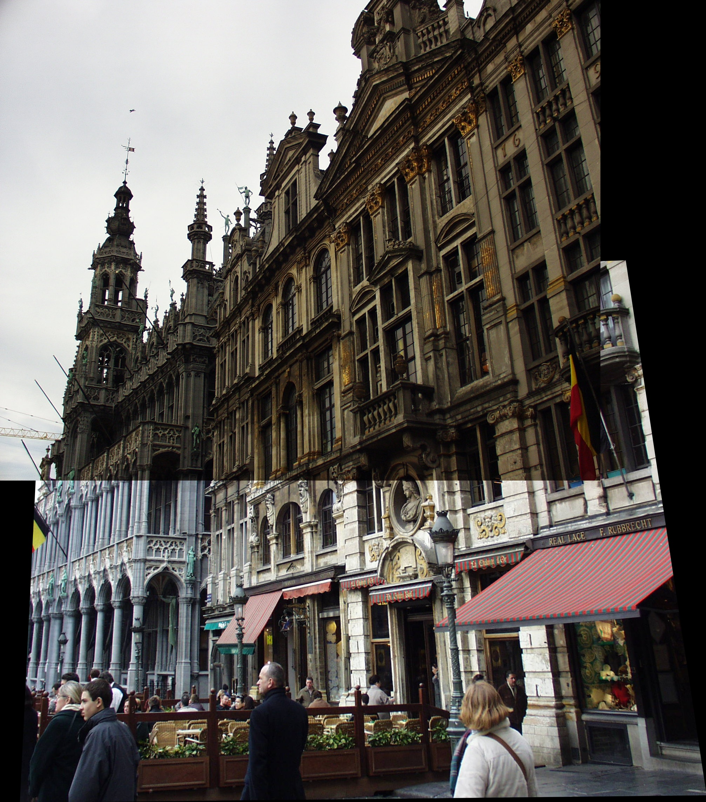
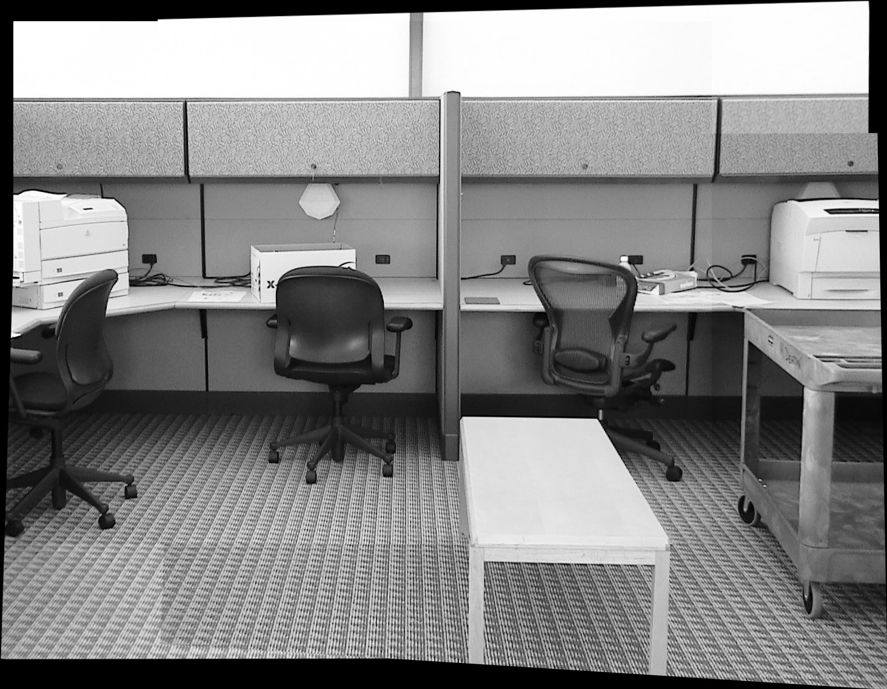
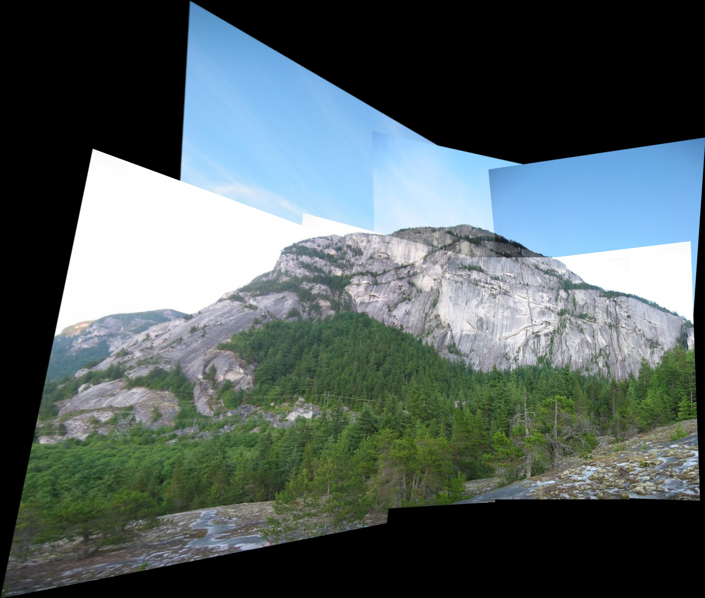
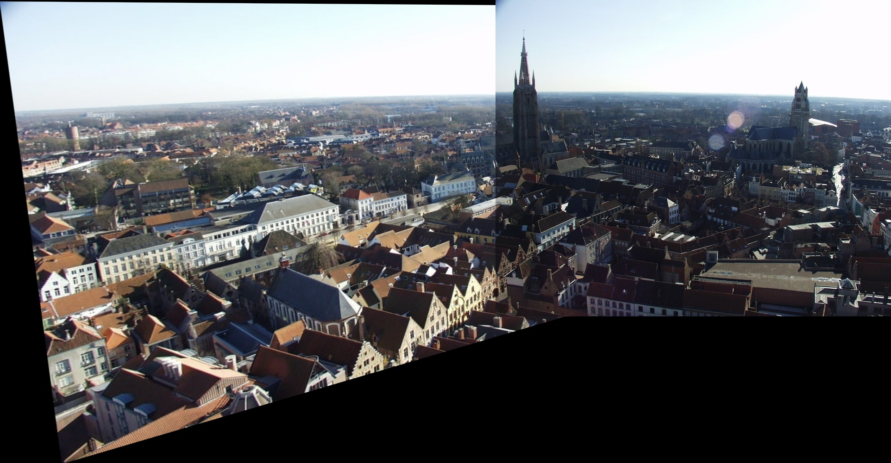

# Image panorama stitching 

This is a code to create one panorama image from a set of input images. 

You can find an explanation of the concept at https://towardsdatascience.com/image-panorama-stitching-with-opencv-2402bde6b46c

I used the SIFT algorithm to extract key_points.
You can use other algorithms to improve the results.  

There are two reasons I share this code:
1) The cv2.Stitcher_create does image enhancement which could be problematic in some usecases.
2) Students can use this minimal code to learn the concept better.


* For most usecases you should use cv2.Stitcher_create instead of this code.  

## Installation

``` shell script
pip install opencv-contrib-python 
```
## How to run

1) Creat one directory containing only your input images. (your images should be name from 0.jpg to n.jpg)
2) Run:
```shell script
python3 main.py  --input_dir {path_to_input_dir} --sequence {sequence_of_images} --key_image {1}--output_dir {path_output_dir}
```
* All arguments except the --input_dir are optional. 

The code tries to find the best image if it is not given by the use, but you can give your own sequence of input images.
You have three options to run the code:

1) You can specify the complete sequence of images, for example 
    ```shell script
   python3 main.py --input_dir inputs/Office/ --sequence "3,2,1,0"
    ```
2) You can specify the first image and the code tries to guess the rest of sequence, for instance:
    ```shell script
   python3 main.py --input_dir inputs/Mountain/ --key_image 3
    ```
3) You can give only the directory and the code tries to find the first image and the sequence.  
    ```shell script
   python3 main.py --input_dir inputs/Brussels/
    ```

* Note that if you specify sequence argument, the code will ignore the --key_image
Here are some results genere

## Results

You can find the images in input folder:

1) Brussels
    ```shell script
    python3 main.py --input_dir inputs/Brussels/
    ```
    

2) Office
    ```shell script
    python3 main.py --input_dir inputs/Office/ --sequence "3,2,1,0"
    ```
    

3) Mountain
    ```shell script
     python3 main.py --input_dir inputs/Mountain/ --key_image 3
    ```
    

4) Tower
    ```shell script
    python3 main.py --input_dir inputs/Tower/
    ```
    
    
